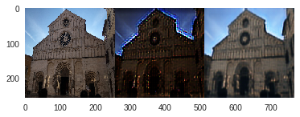
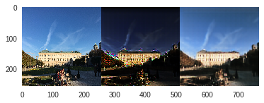
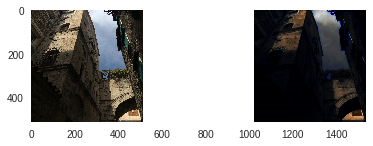
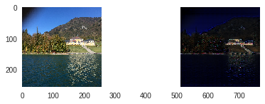
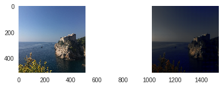
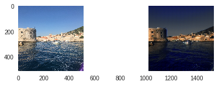
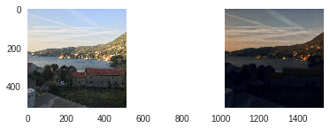
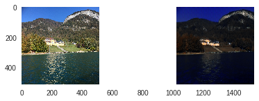
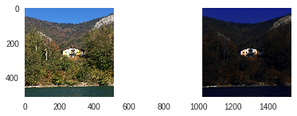

# cycleGAN : day2night

* This repository implemented day2night neural network using cycleGAN (https://arxiv.org/abs/1703.10593)

* This repo is compatible with tf_version >= 2.0 (using tf.keras)

* train and test code are using Google Colaboratory.

## result

1. day -> night -> day (  X-> G(X) -> F( G(X) )  )

2. day -> night ( X -> G(X) )

## Tip
    If you want to using your own photo data taken by your own camera,
    you must rotate yours by exif files info.
    ( see https://github.com/johansatge/jpeg-autorotate )

## See also

* https://colab.research.google.com/drive/1PCKHheQ8GnabPCBT5y2JYHiixlCIMo7m#scrollTo=M5NvfqLUZaky

* https://colab.research.google.com/drive/14UiHI7H2AGMMIbFvgoAf41sKFINZqtmJ#scrollTo=XqOMbQcMWKfr

* https://colab.research.google.com/drive/1gzecEEw6Dqx3otpICxKDXmCnjkZJzhha#scrollTo=IkN9OuQCe8Hb

## License

Project is published under the MIT licence. Feel free to clone and modify repo as you want, but don'y forget to add reference to authors :)